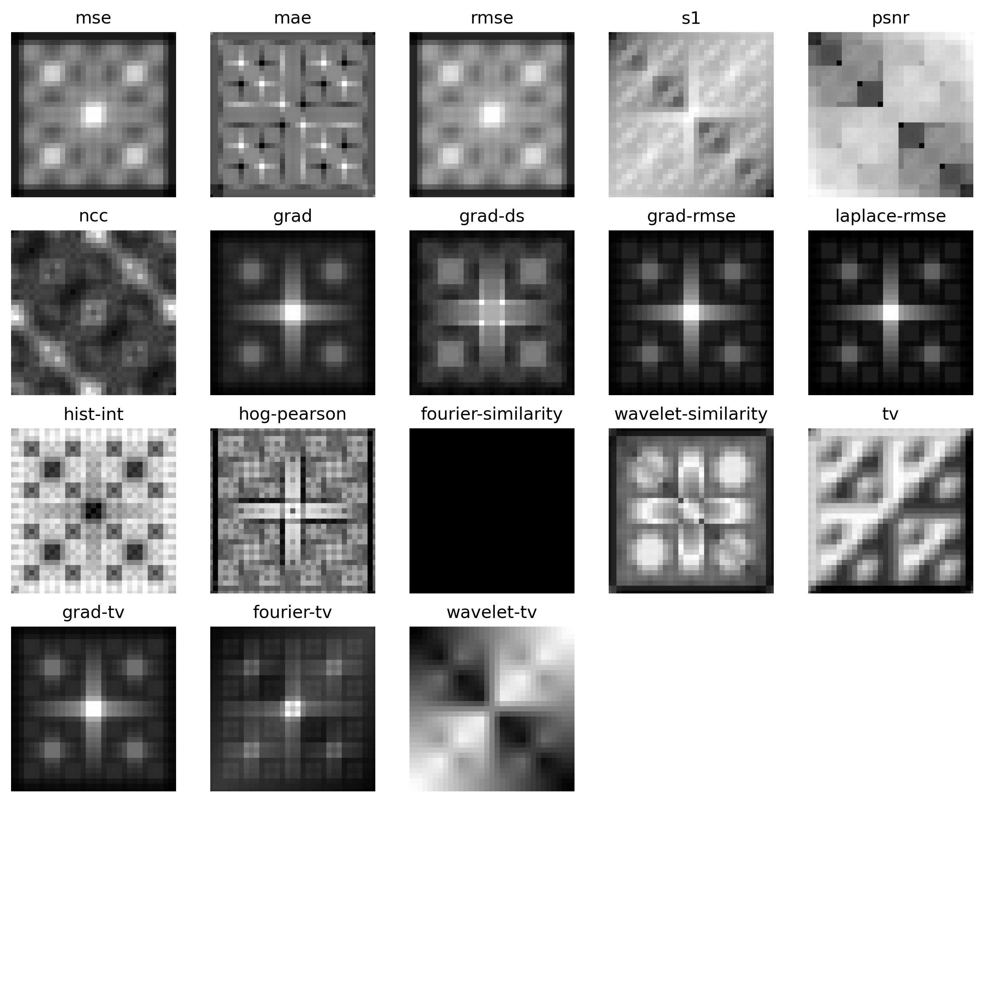

# ai2es-sharpness
This repository serves the sharpness group.  TBC

## Installation

To install this package with all required python packages, clone this repository and from the main directory run
```bash
conda env create --name ai2es-sharpness --file=environment.yml
```
After that completes, activate your new environment and run
```bash
pip install .
```

## Benchmark

Compute evaluations from different metrics and transformations on real or synthetic datasets.


#### Input requirements

At this point, all functions (including the main `benchmark.py` script) take as their input a single `n x m` grayscale image. If using these methods on multi-channel imagery, either convert the image to grayscale (if it is an RGB image) or loop over the channels and compute sharpness statistics individually.

Note that due to the way certain packages we utilize are implemented, some metrics may change depending on the data type used as input; to ensure that images are comparable, make sure that they all have the same underlying datatype (e.g., `np.float32, np.float64, np.uint8,` etc.). For maximum compatibility, image data that is integers in the range (0, 255) should have the type np.uint8, and any data that has a float type should take values in the range (0, 1).

#### Usage

From within the `src` directory:

```bash
$ python benchmark.py -h
usage: benchmark.py [-h] [-s {sinusoidal,gaussian,bw,xor}] [-i INPUT] [-t {vflip,hflip,blur,noise,brightness,crop}] [-m {all,mse,mae,rmse,grad}] [--visualize] [-o OUTPUT]

Sharpness Benchmarks

optional arguments:
  -h, --help            show this help message and exit
  -s {sinusoidal,gaussian,bw,xor}, --synthetic {sinusoidal,gaussian,bw,xor}
                        generate synthetic data
  -i INPUT, --input INPUT
                        name of input file to load data from
  -t {vflip,hflip,blur,noise,brightness,crop}, --transformation {vflip,hflip,blur,noise,brightness,crop}
                        transformation to perform on data
  -m {all,mse,mae,rmse,grad}, --metric {all,mse,mae,rmse,grad,s1,psnr,ncc,grad-ds,grad-rmse,laplace-rmse,hist-int,hog-pearson,fourier-similarity,wavelet-similarity,tv,grad-tv,fourier-tv,wavelet-tv} 
                        evaluation metric to compute
  --heatmap             compute sharpness heatmap(s) rather than global metric
  --visualize           visualize and save the operations
  -o OUTPUT, --output OUTPUT
                        name of output file visualization
```

Note that with the `--heatmap` option, each metric will be computed on small, overlapping tiles across the image; by default, these tiles will be square with side length equal to ~1/8th the width of the input image, and the stride for these tiles will be 1/4 the side length of the tile. The image will also be padded using the "reflect" method by a number of pixels equal to ~1/16th the width of the input image. These parameters are adjustable by editing the appropriate function in `__init__.py`.

#### Examples

Generate synthetic data, apply a blurring transformation, compute all metrics, and visualize/save the output.

```bash
$ python benchmark.py -s xor -t blur -m all --visualize -o ../media/synthetic.png
=> mse: 151.15780639648438
=> mae: 7.190338134765625
=> rmse: 12.294625101908736
=> s1: (3.4584340177879653, 5.106637918264621)
=> psnr: 26.336497800628308
=> ncc: 0.9965684732341967
=> grad: (6.91624727961359e-19, 4.611330123778287e-19)
=> grad-ds: 0.493354541101387
=> grad-rmse: 71.90568391934428
=> laplace-rmse: 26.71850557271238
=> hist-int: 0.645227694933976
=> hog-pearson: 0.6305659890823435
=> fourier-similarity: 1.0
=> wavelet-similarity: 0.13379014374033754
=> tv: (524288, 273158)
=> grad-tv: (3153888.0, 2151308.0)
=> fourier-tv: (38639962.24096394, 31919021.24357993)
=> wavelet-tv: (8388608.0, 8360728.0)
```


We can re-run the above example, but with local computations of heatmaps instead of global metrics.

```bash
$ python benchmark.py -s xor -t blur -m all --heatmap --visualize -o ../media/synthetic_heatmaps.png
Heatmap will be computed with blocks of size 32, and has image padding of length 16
=> mse average: 39.881929874420166
=> mae average: 111.61909246444702
=> rmse average: 6.259764454401335
=> s1 averages: (2.7966713163144616, 4.416437443298626)
=> psnr average: 27.90985194547143
=> ncc average: 1.0957310987654965
=> grad averages: (0.025264954381721993, 0.019396214612508057)
=> grad-ds average: 0.4854998901219907
=> grad-rmse average: 54.209045009739974
=> laplace-rmse average: 20.67599301023201
=> hist-int average: 0.5660052760923319
=> hog-pearson average: 0.6746634025245817
=> fourier-similarity average: 1.0
=> wavelet-similarity average: 0.3293994978185485
=> tv averages: (253952.0, 176779.0)
=> grad-tv averages: (40465.7734375, 30567.400390625)
=> fourier-tv averages: (358239.7522150265, 318628.08900317416)
=> wavelet-tv averages: (65607.43359375, 65929.7275390625)
```


Load the default data example, apply a vertical transformation, compute only the root-mean-square error, and visualize/save the output to the default name.

```bash
$ python benchmark.py -t vflip -m rmse --visualize
Loading data from ../data/kh_ABI_C13.nc (sample 0)
=> rmse: 10.005649078875036
```


Generate synthetic again, but only compute total variation as a heatmap.
```bash
$ python benchmark.py -s='xor' -t='blur' -m='tv' -o='../media/synth_tv.png' --heatmap --visualize
Heatmap will be computed with blocks of size 32, and has image padding of length 16
=> tv averages: (253952.0, 176779.0)
```


